# 📈 Salary Prediction

A full-stack web application that predicts your salary
based on user input using machine learning. Includes retrianing,
data visualization, and dynamic prediction tuning.

[](./LICENSE)
<!-- [](https://github.com/StevenHuang41/salary_prediction/stargazers) -->

## 🔎 Overview
- [Features](#-features)
- [Tech Stack](#-tech-stack)
- [Project Structure](#-project-structure)
- [Installation](#️-installation)
    - [Manual Installation](#-️-manual-installation)
    - [Docker Installation & Setup](#--docker-installation--setup)
- [Usage](#-usage)
    - [Local machine](#3-️-local-machine-access)
    - [Mobile](#4--mobile)
    - [App Instructions](#5--app-instructions)
- [Contributing](#-contributing)
- [License](#-license)
- [Credits](#-credits)

## ✨ Features

- Interactive frontend with clean UI
- Real-time salary predictions
- Editable prediction values and retraining
- Automated model selection & Hyperparameter Optimization
- SQLite data persistence
- Data visualization
- Dockerized development & deployment

## 🛠 Tech Stack

**Frontend:** React / Vite  
**Backend:** python / fastAPI   
**Database:** sqlite3 / pandas  
**ML:** scikit-learn / tensorflow   
**Other:** docker / git / bash  

## 📁 Project Structure

### root

```sh
.
├── README.md
├── docker-compose.yml
├── setup
├── frontend/
├── backend/
├── readme_images/
└── .gitignore
```

### Frontend

```sh
frontend/
├── README.md
├── Dockerfile
├── package.json
├── package-lock.json
├── vite.config.js
├── eslint.config.js
├── index.html
├── src/
├── public/
├── .gitignore
└── .dockerignore
```

### Backend

```sh
backend/
├── README.md
├── Dockerfile
├── main.py
├── uv.lock
├── pyproject.toml
├── requirements.txt
├── my_package/
├── database/
├── .gitignore
└── .dockerignore
```

## ⚙️ Installation

### • 🔐 Clone the repo:  

```sh
# SSH:
git clone git@github.com:StevenHuang41/salary_prediction.git

# or HTTPS:
git clone https://github.com/StevenHuang41/salary_prediction.git

cd salary_prediction
```  

---

### • 🧱 Installation & Setup Methods:

1. [Manual Installation](#2-frontend-installation) (without docker)

2. [Docker Installation & Setup](#docker) (Recommended)

---

### • 🕹️ Manual Installation

- #### Frontend Installation:
    ```sh
    cd frontend
    npm install
    cd ..
    ```  

- #### Backend Installation:
    ```sh
    cd backend
    pip install -r requirements.txt
    ```  

    Alternatively, install uv first
    ```sh
    curl -LsSf https://astral.sh/uv/install.sh | sh
    ```

    then do,

    ```sh
    cd backend
    uv sync --locked # faster than pip install
    cd ..
    ```

## 🚀 Usage 

### 1. Setup 

use `setup` to get __local IP address__ and create `.env.local` files
```sh
./setup
```
expected result:
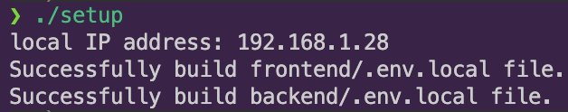

### 2. Start server

open 4 terminals, and run each command respectively.

- **frontend test**

    ```sh
    cd frontend
    npm test
    ```

    expected result:  
    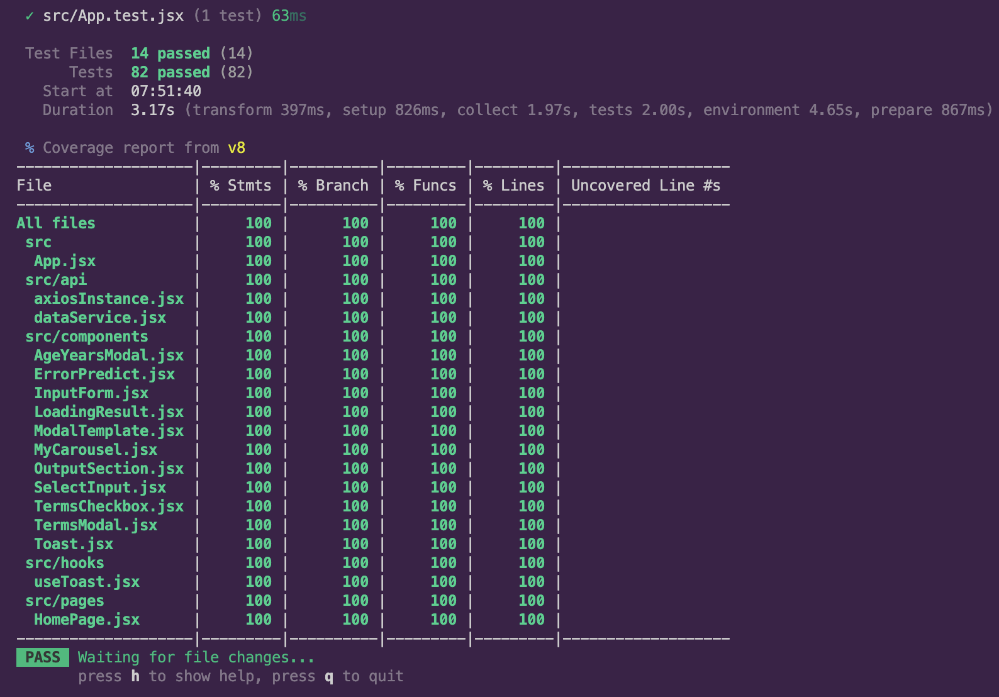

- **frontend server**

    ```sh
    cd frontend
    npm run dev
    ```

    expected result:  
    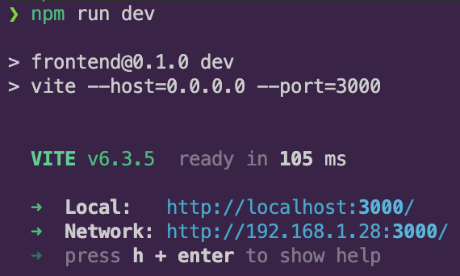

- **Backend server**

    for basic api request

    ```sh
    cd backend
    python main.py 8001
    ```
    Alternatively,
    ```sh
    cd backend
    uv run main.py 8001
    ```

    expected result:  
    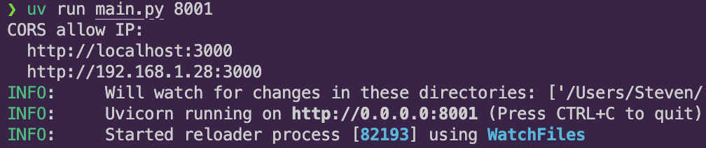

- **backend training server**

    ```sh
    cd backend
    python main.py 8000
    ```
    Alternatively,
    ```sh
    cd backend
    uv run main.py 8000
    ```
    expected result:  
    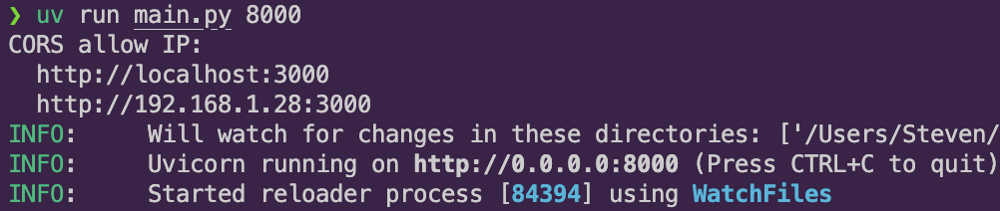

---

### • 🐳 Docker Installation & Setup

Docker handles packages installation & setup, which is much easier than manual installation.

```sh
cd salary_prediction
./setup --build
```

see `./setup --help` for further imformations  

expected result:
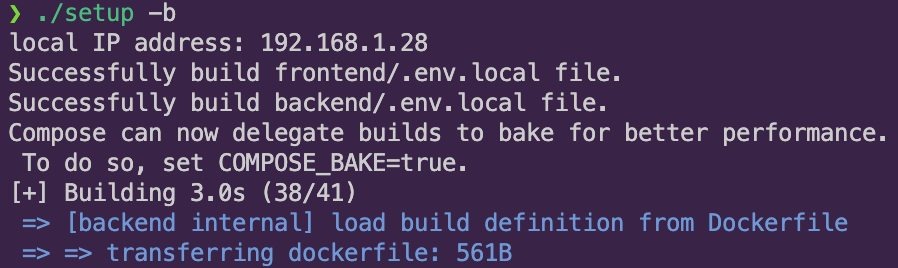

wait until all servers are successfully built

---

### 3. 🖥️ Local Machine Access

- **Frontend:** <http://localhost:3000>

- **Backend:** <http://localhost:8001/docs>

- **Training:** <http://localhost:8000/docs>

**UI preview:**

- frontend:
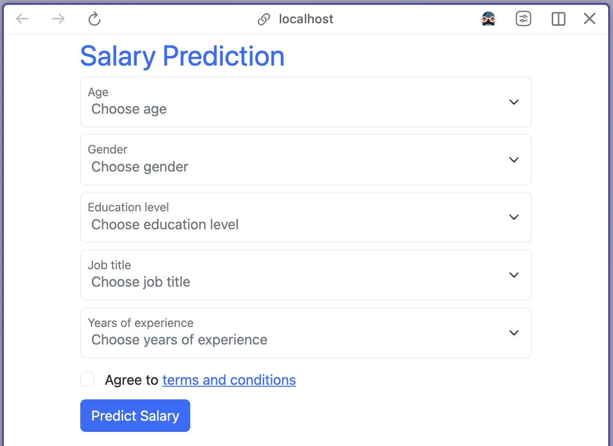

- backend:
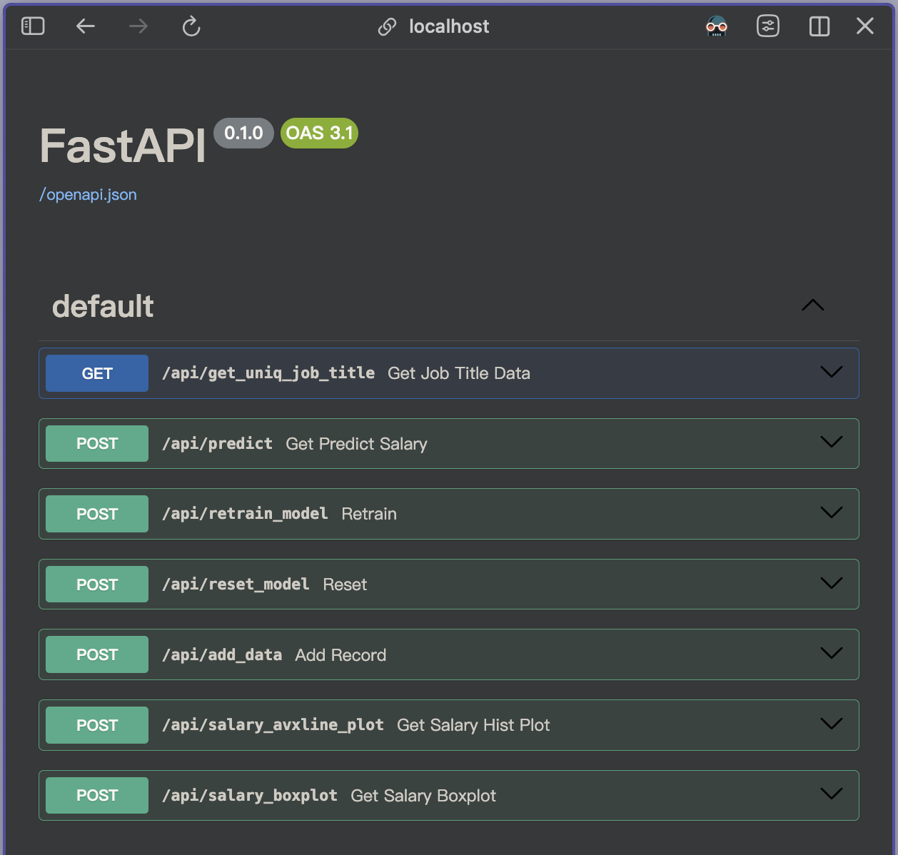

---

### 4. 📱 Mobile

Enter `http://[local IP address]:3000/` in your mobile browser

Replace `[local IP address]` with your local machine [IP address](#1-setup)

**UI preview:**
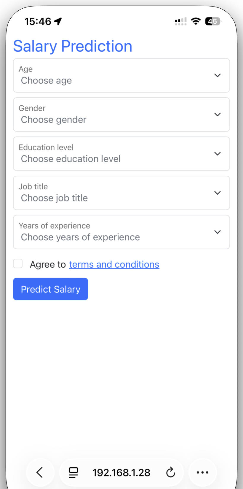


### 5. 📝 App Instructions

- Fill out the form -> click **Predict Salary** button
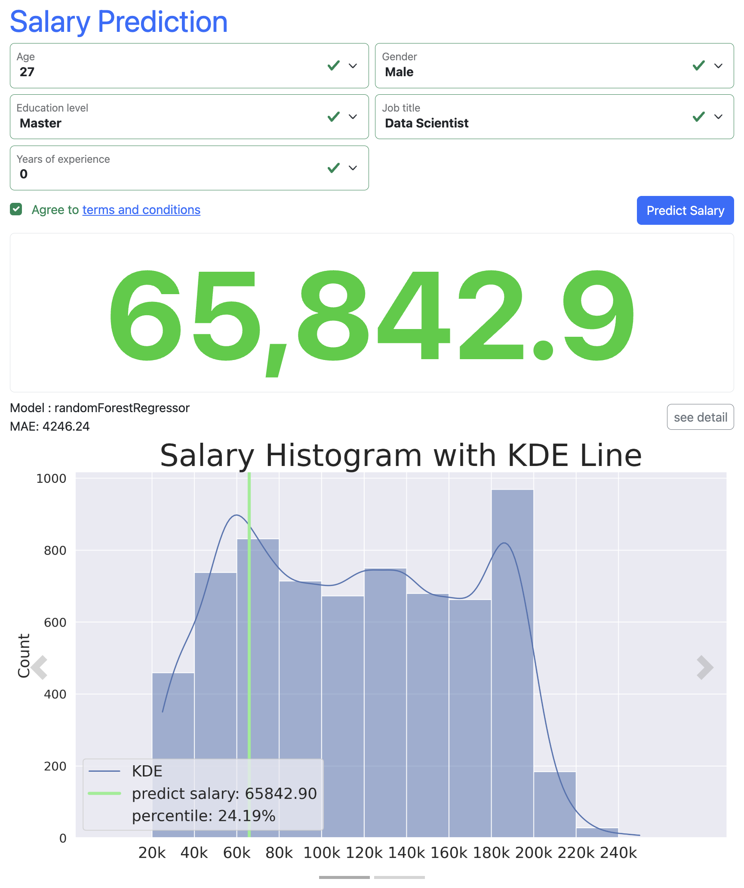

- Click **see detail** button for extended options
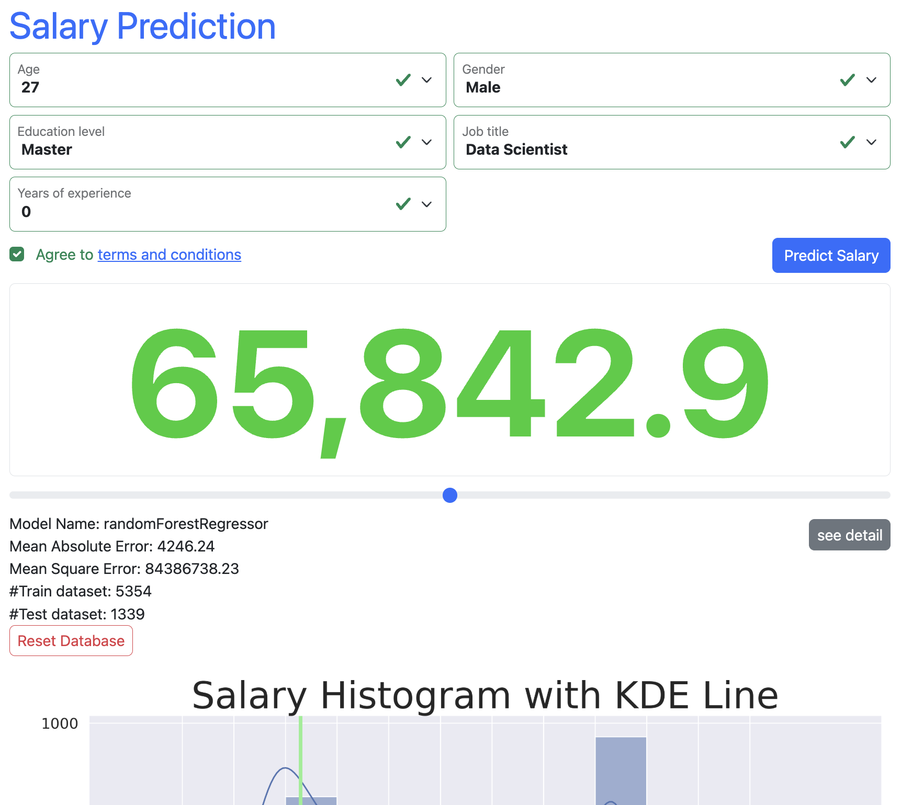

- Change predict value using keyborad or slider
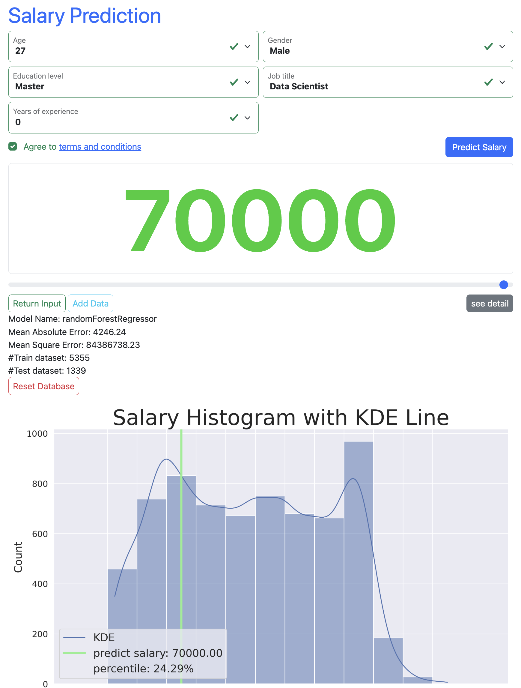
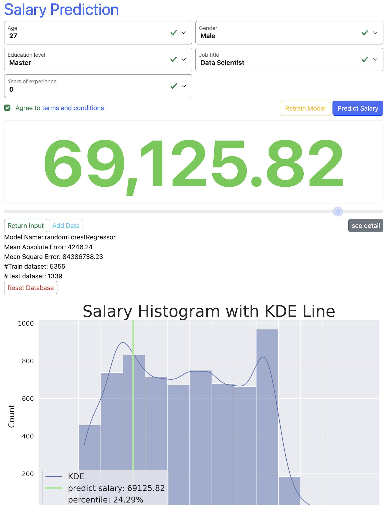

- Click **Add Data** button to store changed prediction 
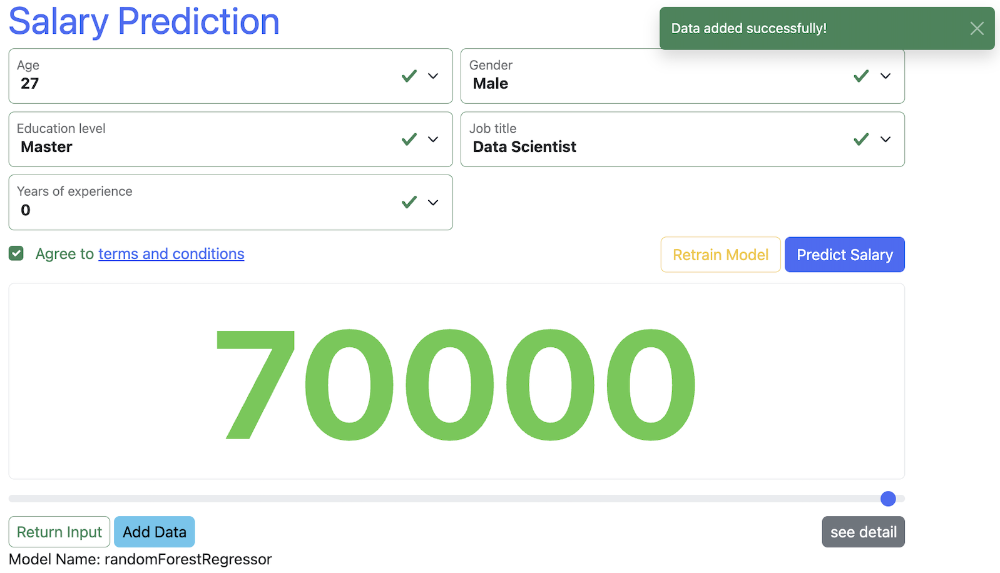

- Click **Retrain Model** button to train on new records
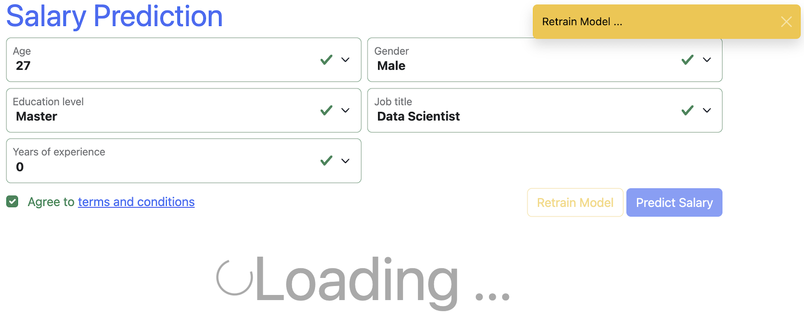

- After retraining (prediction changes)
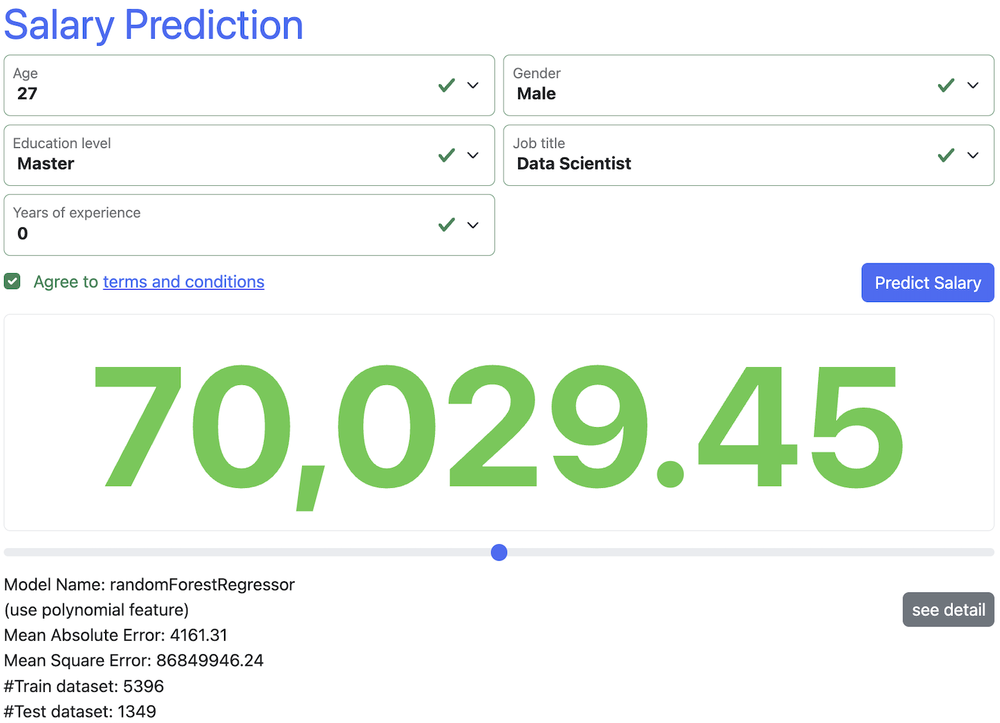

- Click **Reset Database** button to clear added data
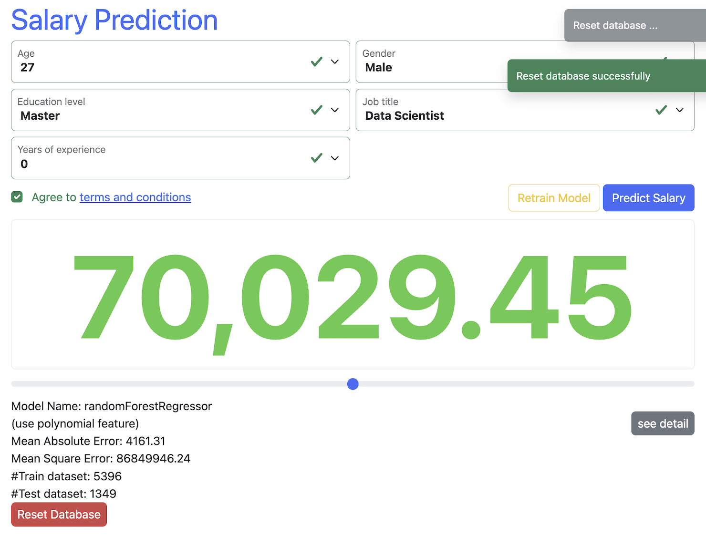


## 🤝 Contributing

1. Fork the repository.
2. Create a new branch
    ```sh
    git switch -c feature-branch
    ```
3. Commit your changes
    ```sh
    git commit -m "Add some feature"
    ```
4. Push to the branch
    ```sh
    git push origin feature-branch
    ```
5. Create a new Pull Request.

## 📄 License

This project is licensed under the [MIT License](./LICENSE).  

## 👏 Credits

Thanks to all contributors!  
See the [contributors list](https://github.com/StevenHuang41/salary_prediction/graphs/contributors)