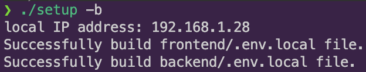
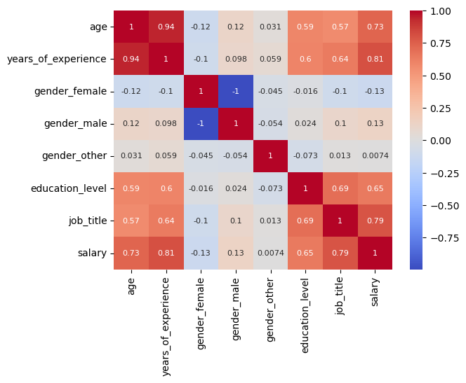

# Salary Prediction

A full stack web application that predicts your salary
based on user input using machine learning.

<!-- ## Motivation -->

## Features

- User-friendly web interface
- Real-time salary predictions
- Data visualization
- Automatical model selection

## Overview
1. [Tech Stack](#tech-stack)
2. [Project Structure](#project-structurej)
    - [root](#root)
    - [frontend](#frontend)
    - [backend](#backend)
3. [Installation](#installation)

## Tech Stack

**Frontend:** React / Vite  
**Backend:** python / fastAPI / bash  
**Database:** sqlite3 / pandas  
**ML:** scikit-learn / tensorflow   
**Other:** docker / git

## Project Structure
### root

```sh
.
├── README.md
├── frontend/
├── backend/
├── docker-compose.yml
└── setup
```

### Frontend

```sh
frontend/
├── README.md
├── Dockerfile
├── package.json
├── package-lock.json
├── vite.config.js
├── eslint.config.js
├── index.html
├── src/
├── public/
└── node_modules/
```

### Backend

```sh
backend/
├── README.md
├── Dockerfile
├── main.py
├── uv.lock
├── pyproject.toml
├── my_package/
└── database/
```

## Installation

1. Clone the repo:  
    **ssh:**  
    ```sh
    git clone git@github.com:StevenHuang41/salary_prediction.git
    ```  
    **http:**  
    ```sh
    git clone https://github.com/StevenHuang41/salary_prediction.git
    ```  
    ---
    then do  
    ```sh
    cd salary_prediction
    ```  

2. Start the app with `setup`
    ```sh
    ./setup -b
    ```  
    see './setup -h' for further imformations  
    checkout [without docker setup](#overview)

3. Access frontend page via browser
  
    ```https
    http://[local IP address]:3000/
    ```  
    change `[local IP address]` to the value shown in terminal  

    you can now start entering informations and predict your salary!
    

<!-- *italics*

***bold and italics***

~~crossed off~~

<mark>highlight</mark>

X<sup>2</sup>

H<sub>2</sub>O

This is `const c = 10`

```bash
docker build -t backend .
docker run -it backend
```

    print('like code')
    print('just indent')

[link](https://google.com)

<https://google.com>




> block
> code
>> syntax
>>> can
>>> have
>>>> multiple.
>>>>
>>>> layer

divide

___

line1

divide

---

line2

divide

***

line3

1. item 1
2. item 2
3. item 3

---

1. item 1
1. item 2
1. item 3

---

* p1
* p2
* p3

---

+ p1
+ p2
+ p3

---

- p1
    + a
    + b
        * c
            1. d
            1. e
- p2
- p3

| col1  | col2    |
| :---: | ------: |
| this  | is      |
| an    | example |
| table | with    |
| two   | columns |

---

- [ ] checkbox
- [x] checked -->