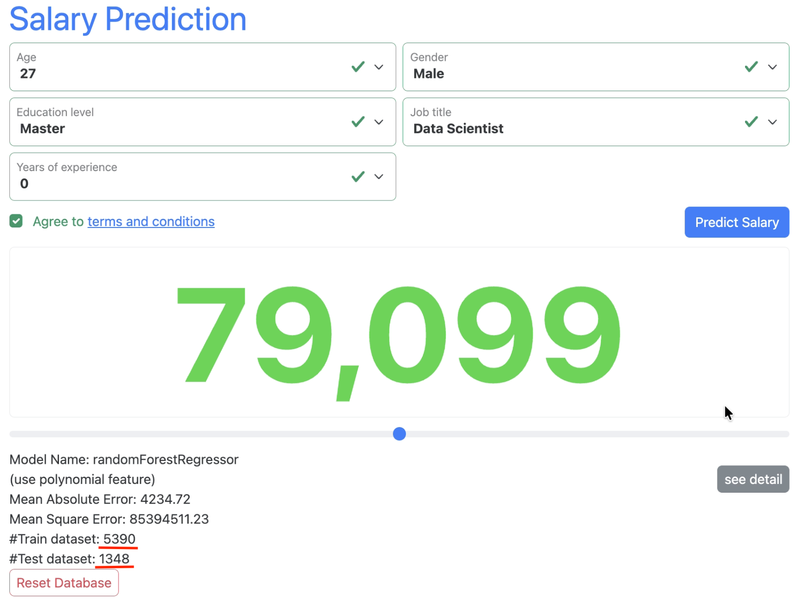

# Salary Prediction

A full stack web application that predicts your salary
based on user input using machine learning.

<!-- ## Motivation -->

## Overview
- [Features](#features)
- [Tech Stack](#tech-stack)
- [Project Structure](#project-structurej)
    - [root](#root)
    - [frontend](#frontend)
    - [backend](#backend)
- [Installation](#installation)
    - [Installation & Setup Methods](#installation--setup-methods)

## Features

- Intuitive web interface
- Real-time salary predictions
- Iteractive data management & Model retraining
- Automated model selection & Hyperparameter Optimization
- Dynamic prediction adjustment
- Data visualization


## Tech Stack

**Frontend:** React / Vite  
**Backend:** python / fastAPI / bash  
**Database:** sqlite3 / pandas  
**ML:** scikit-learn / tensorflow   
**Other:** docker / git

## Project Structure
### root

```sh
.
├── README.md
├── docker-compose.yml
├── setup
├── frontend/
├── backend/
├── readme_images/
└── .gitignore
```

### Frontend

```sh
frontend/
├── README.md
├── Dockerfile
├── package.json
├── package-lock.json
├── vite.config.js
├── eslint.config.js
├── index.html
├── src/
├── public/
├── .gitignore
└── .dockerignore
```

### Backend

```sh
backend/
├── README.md
├── Dockerfile
├── main.py
├── uv.lock
├── pyproject.toml
├── requirements.txt
├── my_package/
├── database/
├── .gitignore
└── .dockerignore
```

## Installation

### 1. Clone the repo:  

```sh
# ssh:
git clone git@github.com:StevenHuang41/salary_prediction.git
```

Alternatively,  

```sh
# http:
git clone https://github.com/StevenHuang41/salary_prediction.git
``` 
then do,  
```sh
cd salary_prediction
```  

---

### Installation & Setup Methods:

1. [Manual Installation](#2-frontend-installation) (without docker)

2. [Docker](#docker) (Recommended)

---

### 2. frontend Installation:
```sh
cd frontend
npm install
cd ..
```  

---

### 3. backend Installation:
```sh
cd backend
pip install -r requirements.txt
```  

Alternatively, install uv first
```sh
curl -LsSf https://astral.sh/uv/install.sh | sh
```

then do,

```sh
cd backend
uv sync --locked # faster than pip install
cd ..
```

## Usage 

### 1. Setup 

use `setup` to create .env.local files
```sh
./setup
```
expected result:


### 2. Start server

open 4 terminals, and run each command respectively.

- **frontend test**

    ```sh
    cd frontend
    npm test
    ```

    expected result:  
    

- **frontend server**

    ```sh
    cd frontend
    npm run dev
    ```

    expected result:  
    

- **Backend server**

    for basic api request

    ```sh
    cd backend
    python main.py 8001
    ```
    Alternatively,
    ```sh
    cd backend
    uv run main.py 8001
    ```

    expected result:  
    

- **backend training server**

    ```sh
    cd backend
    python main.py 8000
    ```
    Alternatively,
    ```sh
    cd backend
    uv run main.py 8000
    ```
    expected result:  
    

---

### Docker 

Docker handles packages installation & setup, which is much easier than manual installation.

```sh
cd salary_prediction
./setup --build
```

see `./setup --help` for further imformations  

expected result:


wait until all servers are successfully built

---

### 3. Access

#### **Browser**

- **Frontend:** <http://localhost:3000>

- **Backend:** <http://localhost:8001/docs>

- **Training:** <http://localhost:8000/docs>

expected result:  
- frontend:


- backend:


---

#### **Mobile**

enter `http://[local IP address]:3000/` in your mobile browser

replace `[local IP address]` with your local machine [IP address](#1-setup)

expected result:


### 4. App Instructions

after entering informations, press the **Predict** Salary button


click **see detail** button for further functions


change predict value by keyborad


alternatively, change predict value by range bar


click **Add Data** button


click **Retrain Model** button to retrain model based on changed predict value


result of retraining model, (predict value larger)


click **Reset Database** button, clean the database from added data


## Contribution

1. Fork the repository.
2. Create a new branch
    ```sh
    git switch -c feature-branch
    ```
3. Commit your changes
    ```sh
    git commit -m "Add some feature"
    ```
4. Push to the branch
    ```sh
    git push origin feature-branch
    ```
5. Create a new Pull Request.

## License

This project is licensed under the ... License.
See the [LICENSE](LICENSE) file for details.

## Credits

Thanks to all contributors!
See the [contributors list](https://github.com/StevenHuang41/salary_prediction/graphs/contributors)
<!-- 

This project is licensed under the MIT License - see the [LICENSE](LICENSE) file for details. -->